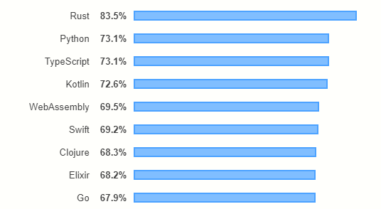
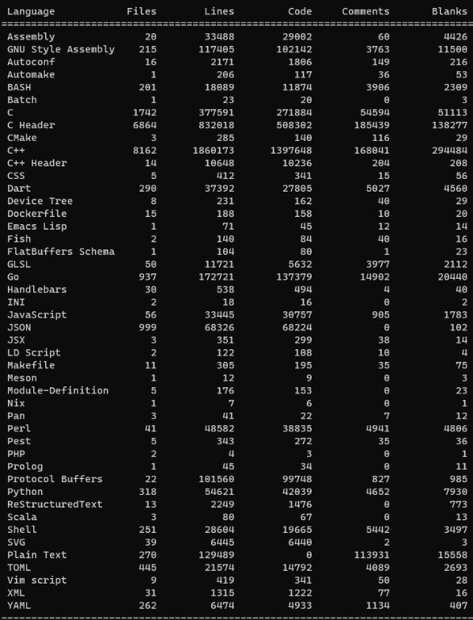
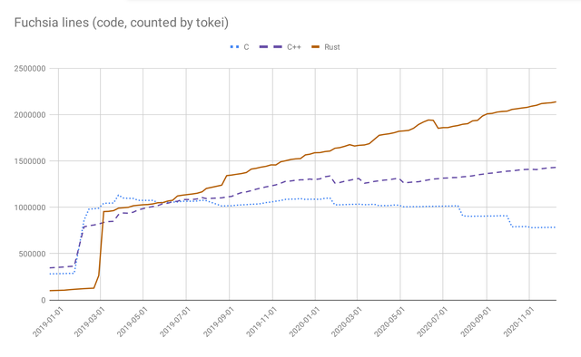

[English](index.html)

# 可信编程 -- 华为引领Rust语言开发的实践和愿景

*Yijun Yu*

可信编程首席专家\
华为可信软件工程开源实验室

*Amanieu d'Antras*

Rust高级专家\
华为可信软件工程开源实验室

## Rust带来的创新

StackOverflow的调查表明, 自2015年以来，Rust一直是开发者最爱的编程语言。

{width=500px}\

学术界对于Rust也越来越重视，在编程语言和软件工程顶会上发表的关于Rust的论文正逐年增加。

\

不仅如此，《自然》杂志2020年尾的文章《Why Scientists are Turning to Rust》中也强调：科学家极为推崇Rust。

{width=500px}\

## Rust在华为的初步推进

华为的目标是引领通信系统软件向安全可信演进，其中Rust语言正在发挥很大的作用。

例如，我们希望通过部分C/C++代码的迁移，在保证高性能的同时，拥有更高的安全性。在此过程中，
我们为开发者提供一套自动化工具支持：基于开源的[C2Rust](https://c2rust.com/)转译工具，
首先从C代码生成Rust代码, 然后通过源到源变换工具自动重构。

在华为内部我们还基于actor的并发编程模式开发了Rust库，方便程序员充分利用
Rust的语言特性, 例如`async`, `await`等。

以华为代表的通信系统软件的开发以C/C++代码为主, 这些Rust库将使C/C++到Rust的迁移更加顺畅。
作为业界领先公司和Rust基金会的创始成员，华为致力于Rust在通信软件行业，并将持续为Rust社区做出贡献。

## 华为对Rust社区的贡献

我们为Rust社区贡献了许多重要的功能特性。例如，我们最近为Rust编译器提交了一系列代码，使得Rust编译目标可以支持ARM AArch64 32位大端变体[ILP32](https://developer.arm.com/documentation/dai0490/latest/)芯片组, 用于我们的通信产品中。
这些改进使得我们和友商可以在这些常用网络硬件架构上执行Rust原生程序。这些代码已经通过我们的Rust专家Amanieu d'Antras 提交给了[LLVM 编译器](https://reviews.llvm.org/rG21bfd068b32ece1c6fbc912208e7cd1782a8c3fc), [libc库](https://github.com/rust-lang/libc/pull/2039), 以及[Rust编译器](https://github.com/rust-lang/rust/pull/81455)等开源社区。

这些对Rust编译器的更改引入了新的端到端交叉编译目标，针对定制硬件构建Rust产品变得更容易,只需要简单的命令，比如：

```bash
cargo build --target aarch64_be-unknown-linux-gnu
cargo build --target aarch64-unknown-linux-gnu_ilp32
cargo build --target aarch64_be-unknown-linux-gnu_ilp32
```

在社区参与方面，华为一直在中国牵头，于12月26-27日在深圳主办了首届Rust China Conf。我们已经开始通过开展一系列活动来带领社区和对Rust感兴趣的开发人员创建Rust的中文教程和Rust编码规范。

## C到Rust转译

我们举个例子说明C到Rust转译这项能力。下面的C程序实现Rosetta Code中的"100门"算法。

```c
#include <stdio.h>
 
int main()
{
  char is_open[100] = { 0 };
  int pass, door;
 
  /* do the 100 passes */
  for (pass = 0; pass < 100; ++pass)
    for (door = pass; door < 100; door += pass+1)
      is_open[door] = !is_open[door];
 
  /* output the result */
  for (door = 0; door < 100; ++door)
    printf("door #%d is %s.\n", door+1, (is_open[door]? "open" : "closed"));
 
  return 0;
}
```

开源的[c2rust](https://github.com/immunant/c2rust)转译器最初产生以下Rust代码：

```rust
#![allow(dead_code, mutable_transmutes, non_camel_case_types, non_snake_case,
         non_upper_case_globals, unused_assignments, unused_mut)]
#![register_tool(c2rust)]
#![feature(main, register_tool)]
extern "C" {
    #[no_mangle]
    fn printf(_: *const libc::c_char, _: ...) -> libc::c_int;
}
unsafe fn main_0() -> libc::c_int {
    let mut is_open: [libc::c_char; 100] =
        [0 as libc::c_int as libc::c_char, 0, 0, 0, 0, 0, 0, 0, 0, 0, 0, 0, 0,
         0, 0, 0, 0, 0, 0, 0, 0, 0, 0, 0, 0, 0, 0, 0, 0, 0, 0, 0, 0, 0, 0, 0,
         0, 0, 0, 0, 0, 0, 0, 0, 0, 0, 0, 0, 0, 0, 0, 0, 0, 0, 0, 0, 0, 0, 0,
         0, 0, 0, 0, 0, 0, 0, 0, 0, 0, 0, 0, 0, 0, 0, 0, 0, 0, 0, 0, 0, 0, 0,
         0, 0, 0, 0, 0, 0, 0, 0, 0, 0, 0, 0, 0, 0, 0, 0, 0, 0];
    let mut pass: libc::c_int = 0;
    let mut door: libc::c_int = 0;
    /* do the 100 passes */
    pass = 0 as libc::c_int;
    while pass < 100 as libc::c_int {
        door = pass;
        while door < 100 as libc::c_int {
            is_open[door as usize] =
                (is_open[door as usize] == 0) as libc::c_int as libc::c_char;
            door += pass + 1 as libc::c_int
        }
        pass += 1
    }
    /* output the result */
    door = 0 as libc::c_int;
    while door < 100 as libc::c_int {
        printf(b"door #%d is %s.\n\x00" as *const u8 as *const libc::c_char,
               door + 1 as libc::c_int,
               if is_open[door as usize] as libc::c_int != 0 {
                   b"open\x00" as *const u8 as *const libc::c_char
               } else { b"closed\x00" as *const u8 as *const libc::c_char });
        door += 1
    }
    return 0 as libc::c_int;
}
#[main]
pub fn main() { unsafe { ::std::process::exit(main_0() as i32) } }
```

虽然生成的Rust代码可编译，但是不易维护，其中所有函数都被标记为`unsafe'，必须由程序员负责它的安全性。虽然c2rust支持重构命令，但是它们需要由经验丰富的Rust程序员提供和调整才能奏效。

为了更好地获得Rust语言编译器的安全保证，华为的方案采用了基于[TXL](http://txl.ca)这个高效的源到源转换工具。我们给开源社区提供了一个健壮的[Rust TXL语法](http://txl.ca/examples/Grammars/Rust/README.txt)，并用它来开发
有正确语义保证的自动重构模式，实现更安全、更可维护的Rust代码。例如

```rust
// #include <stdio.h>
fn main() {
    let mut is_open: [i8; 100] = [0; 100];
    for pass in 0..100 {
        let mut door = pass as usize;
        while door < 100 {
            is_open[door] = !is_open[door];
            door += pass + 1;
        }
    }
    for door in 0..100 {
        print!(
            "door #{} is {}.\n",
            door + 1,
            (if (is_open[door]) != 0 {
                "open"
            } else {
                "closed"
            })
        );
    }
}
```

这里的Rust代码不再有`unsafe'块，Rust程序员也完全可理解。

## 配置华为的端到端Rust工具链

Rust社区中有几种端到端的工具，我们已经开始从开发人员和工具的交互中获取信息。

这里有一些例子

### tokei

由于可信编程项目通常涉及多个编程语言，我们采用了[`tokei`](https://github.com/XAMPPRocky/tokei)作为多语言代码复杂性度量工具，识别多达200种编程语言。例如，开源的Fuchhia项目涉及了多种编程语言，下面的统计信息显示有多少行不同语种的代码：

\

C、C++、Rust代码在Fuchhia项目的占比，可以绘制成如下演进图：

\

为了在大型项目中满足处理多种编程语言的场景需求，我们提交代码到[`tokei`](https://github.com/XAMPPRocky/tokei/pull/678)支持识别编程语言的批处理。

### cargo-geiger

为了提高安全性，我们经常想知道有多少代码已经被Rust编译器检查过。幸运的是，通过统计`不安全'项目，如`fn`、`expr`，`struct`、`impl`、`trait`及其在各相关库实现中的出现次数，[`cargo-geiger`](https://github.com/rust-secure-code/cargo-geiger)通过这种方式完成了这个任务。

\

不过，统计数字中并没有反映安全性，所以没办法展现Rust项目总体上取得了多少进展的比例。因此，我们
提交了[代码](https://github.com/rust-secure-code/cargo-geiger/pull/167)，在改进的`cargo-geiger`计数器报告中提供Rust项目的安全检查比率。这个代码采纳后，我们的产品团队现在每天定期都在使用这个工具，一份典型的报告能够更容易理解哪些代码库还没被Rust编译器完全检查到。

\
\

## 通过深度代码学习研究Rust

随着Rust开源社区代码的发展和革新，初学者需要学习掌握Rust最佳的实践，其包括但不限于Rust语言本身。把统计机器学习的方法应用到源代码数据上，也称为[大代码](https://arxiv.org/abs/1709.06182)，正被全世界的软件工程研究团队关注：类似于 图像处理和自然语言处理中的机器学习问题，这些问题都需要通过深度神经网络(deep neural networks DNN)提取大量的特征，Big Code可能同样需要去训练DNN来反映程序的统计特性，所以也称为"深度代码学习"。

在这方面，华为与[英国开放大学](https://mcs.open.ac.uk/yy66)和[新加坡管理大学](http://www.mysmu.edu/faculty/lxjiang/)进行技术合作，在现在最先进的“跨语言”深度代码学习基础上进行优化研究。

例如，最初的深度代码学习方法应用于北京大学编程课程收集到的104个算法类的5.2万个C/C++程序。对此数据集，树基卷积神经网络(TBCNN)算法分类准确率达到94%，
[(AAAI'16)](https://github.com/bdqnghi/tbcnn.tensorflow)。最近的SOTA在语句级使用抽象语法树
[(ICSE '19)](https://github.com/zhangj111/astnn)准确率达到98%。近期我们同[英国开放大学](https://mcs.open.ac.uk/yy66)和[新加坡管理大学](http://www.mysmu.edu/faculty/lxjiang/)在树基胶囊网络的合作研究进展推动了SOTA进一步提高，达到98.4%的准确率[(AAAI'21)](https://arxiv.org/abs/2009.09777)。

早些时候我们已经使用跨语言的数据集表明，对一种编程语言的深度代码学习模型也适用于另一种编程语言。例如，从GitHub爬取的数据集Rosetta Code，从Java到C语言，可以获得86%的算法分类准确度 [(SANER'19)](https://github.com/bdqnghi/bi-tbcnn)，在Java到C#的跨语言API映射
问题也能发挥重要作用[(ESEC/FSE'19)](https://github.com/bdqnghi/SAR_API_mapping)。这些统计语言模型在软件工程中可以应用于很多方面，比如代码分类、代码搜索、代码推荐、代码摘要、方法名称预测、代码克隆检测等等[(ICSE'21)](https://github.com/bdqnghi/infercode)。

为了进一步研究分析Rust项目，我们向[Rust解析器项目`tree-sitter`](https://github.com/tree-sitter/tree-sitter/pull/863)和XML序列化
[`quick-xml`](https://github.com/tafia/quick-xml/pull/250)等项目提交了代码，通过
Rust程序的抽象语法树来训练深度代码学习模型。研究的初步结果很有希望，算法检测任务在
Rust代码上的精度高达85.5%。随着工具链的改进，这个比例还有望进一步提升。

在IDE上的原型是在Visual Studio Code IDE上，我们开发扩展插件，使得程序员可以得到合适的算法推荐和可解释性的帮助。

## 结论

综上所述，华为可信开源软件工程实验室正在开展的Rust工作为程序员提供智能化端到端IDE工具链，以期最大限度地提高代码的安全性和高性能。走向可信编程远景的旅程刚刚开始，我们希望与Rust社区和即将成立的Rust基金会深度合作，引领电信软件产业的可信革新。

