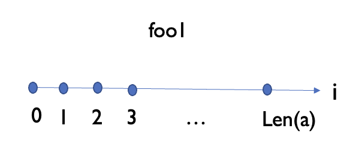

# Auto parallelize Rust code

```
Li Yuan, Chunmiao Li, and Yijun Yu
Trusted Programming
Trusted Software Engineering & Open Source Lab
Huawei Technologies
```

Sequential programs in Rust can be parallelized into parallel programs using Rayon or Scoped Thread features
by simply adding a feature for the code to compile. 

For example, this code
```rust
fn count_prime(a: i32, b: i32) -> i32 {
    // other statements
    let mid = (a + b) / 2;
    let lo = count_prime(a, mid);
    let hi = count_prime(mid, b);
    lo + hi
}
```
will have the same effect as the following code
```rust
extern crate rayon;
fn count_prime(a: i32, b: i32) -> i32 {
    // other statements
    let mid = (a + b) / 2;
    let (lo, hi) = rayon::join(|| count_prime(a, mid), || count_prime(mid, b));
    lo + hi
}
```

On the other hand, the current implementation relies on modifications to the compiler. We need to add a mir 
conversion pass to implement the replacement of the traversal interface and the parallel interface. Such an 
implementation is relatively obscure and difficult to extend.
So I think we can implement a 'two-stage' compilation scheme. This scheme has three steps: 
(1) When compiling for the first time, only obtain all the required compilation process information. 
(2) Data dependency and parallelism analysis based on the collected information
(3) Use the text modification tool to modify the source code to obtain the parallelized code, and finally 
use the compiler for secondary compilation.
This way we can minimize changes to the compiler and allow for more complex analysis in the future, 
such as analyzing the optimal granularity of function parallelism through the flame graph of the program run.

## Updates
- [x] Proof of concept implementation on an example sequential program. [commit here](https://github.com/rust-lang/rust/commit/a6eb7fcbd51e2ae7415c830e3d255aa9a6db7804)
- [ ] Implement automatic transformation from serial iterators to rayon's parallel iterators.
1. Get dependency information in loops and iterators, for example:
```rust
fn foo1(a: &mut [u32], mut b: u32) {
    a.into_iter().for_each(|ai| *ai *= b);
}

fn foo2(a: &mut [u32], mut b: u32) {
    a.into_iter().for_each(|ai| b*= ai);
}
```
There is no dependency between foo1 iterations and can be parallelized; while there is a dependency between foo2 iterations and cannot be parallelized 
(for the time being, methods such as map-reduce are not considered)

The above dependency analysis diagram (by Chunmiao):



2. Modify serial source code with relevant tools
- [ ] Implement 'two-stage' compilation to minimize changes to the compiler.
- [ ] Test on AICPU and Ylong_RUST projects.
- [ ] Submit a pre-pre-RFC on the official Rust forum.
- [ ] Automatic granularity control through profile analysis.
